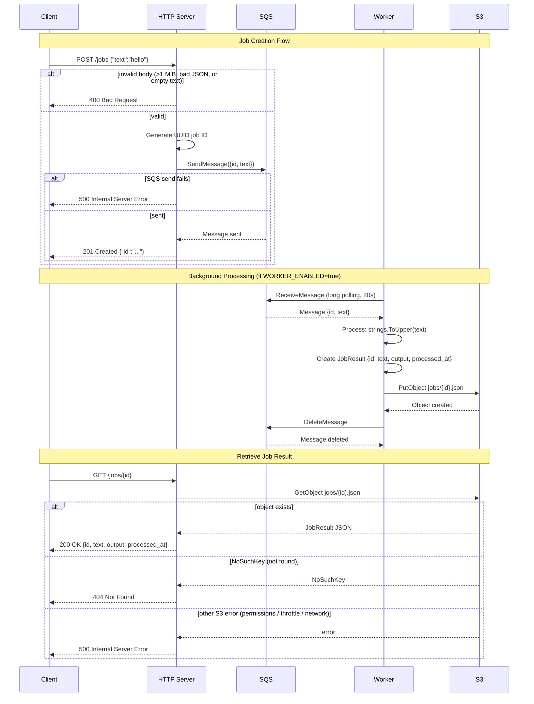
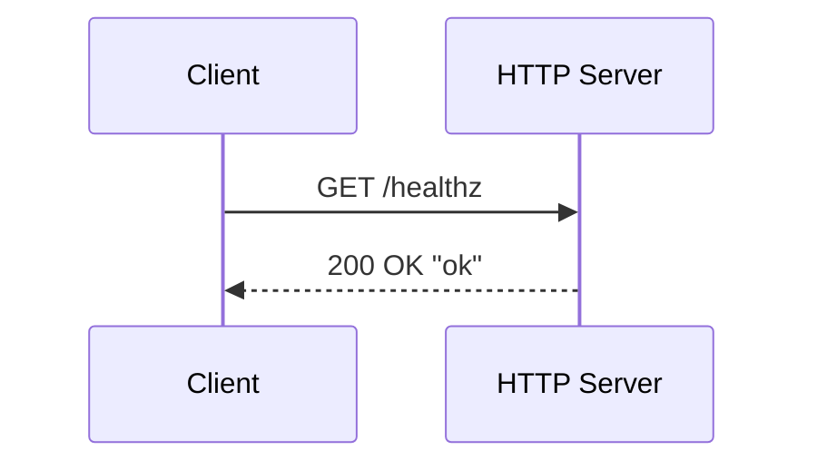
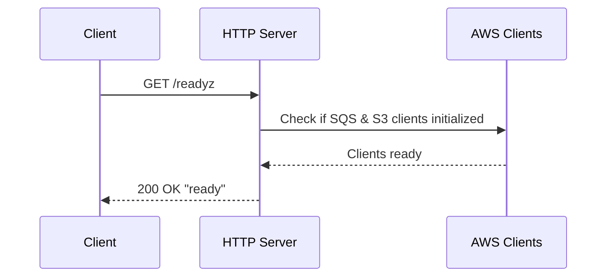
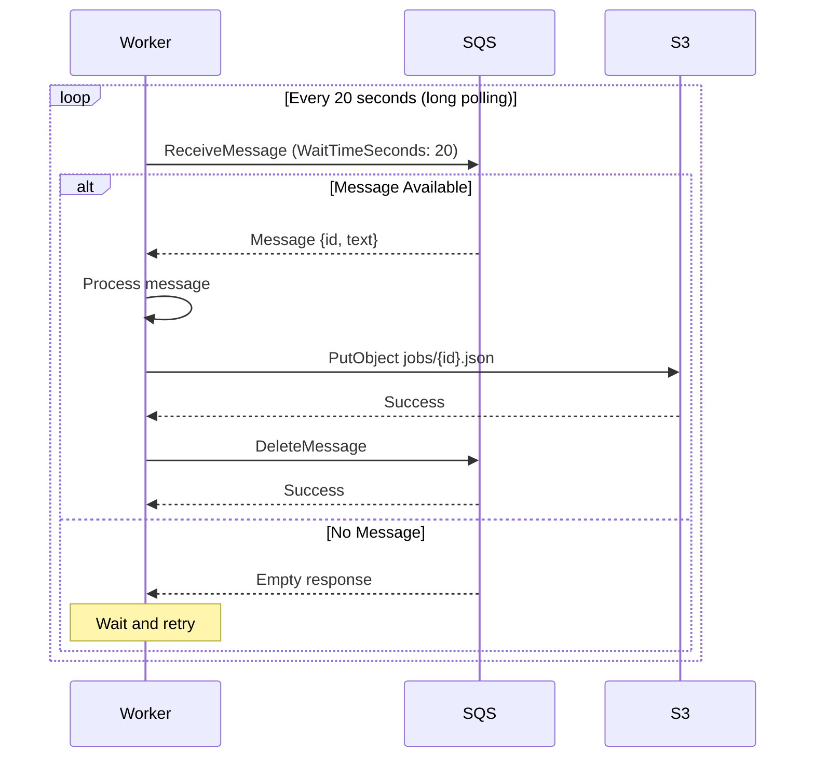

# Sequence Diagram

## Job Processing Flow

```mermaid
sequenceDiagram
    participant Client
    participant HTTP Server
    participant SQS
    participant Worker
    participant S3

    Note over Client,S3: Job Creation Flow
    Client->>HTTP Server: POST /jobs {"text":"hello"}
    alt invalid body (>1 MiB, bad JSON, or empty text)
        HTTP Server-->>Client: 400 Bad Request
    else valid
        HTTP Server->>HTTP Server: Generate UUID job ID
        HTTP Server->>SQS: SendMessage({id, text})
        alt SQS send fails
            HTTP Server-->>Client: 500 Internal Server Error
        else sent
            SQS-->>HTTP Server: Message sent
            HTTP Server-->>Client: 201 Created {"id":"..."}
        end
    end

    Note over Client,S3: Background Processing (if WORKER_ENABLED=true)
    Worker->>SQS: ReceiveMessage (long polling, 20s)
    SQS-->>Worker: Message {id, text}
    Worker->>Worker: Process: strings.ToUpper(text)
    Worker->>Worker: Create JobResult {id, text, output, processed_at}
    Worker->>S3: PutObject jobs/{id}.json
    S3-->>Worker: Object created
    Worker->>SQS: DeleteMessage
    SQS-->>Worker: Message deleted

    Note over Client,S3: Retrieve Job Result
    Client->>HTTP Server: GET /jobs/{id}
    HTTP Server->>S3: GetObject jobs/{id}.json
    alt object exists
        S3-->>HTTP Server: JobResult JSON
        HTTP Server-->>Client: 200 OK {id, text, output, processed_at}
    else NoSuchKey (not found)
        S3-->>HTTP Server: NoSuchKey
        HTTP Server-->>Client: 404 Not Found
    else other S3 error (permissions / throttle / network)
        S3-->>HTTP Server: error
        HTTP Server-->>Client: 500 Internal Server Error
    end
```

## Health Check Flow

```mermaid
sequenceDiagram
    participant Client
    participant HTTP Server

    Client->>HTTP Server: GET /healthz
    HTTP Server-->>Client: 200 OK "ok"
```

## Readiness Check Flow

```mermaid
sequenceDiagram
    participant Client
    participant HTTP Server
    participant AWS Clients

    Client->>HTTP Server: GET /readyz
    HTTP Server->>AWS Clients: Check if SQS & S3 clients initialized
    AWS Clients-->>HTTP Server: Clients ready
    HTTP Server-->>Client: 200 OK "ready"
```

## Worker Loop (Continuous)

```mermaid
sequenceDiagram
    participant Worker
    participant SQS
    participant S3

    loop Every 20 seconds (long polling)
        Worker->>SQS: ReceiveMessage (WaitTimeSeconds: 20)
        alt Message Available
            SQS-->>Worker: Message {id, text}
            Worker->>Worker: Process message
            Worker->>S3: PutObject jobs/{id}.json
            S3-->>Worker: Success
            Worker->>SQS: DeleteMessage
            SQS-->>Worker: Success
        else No Message
            SQS-->>Worker: Empty response
            Note over Worker: Wait and retry
        end
    end
```

